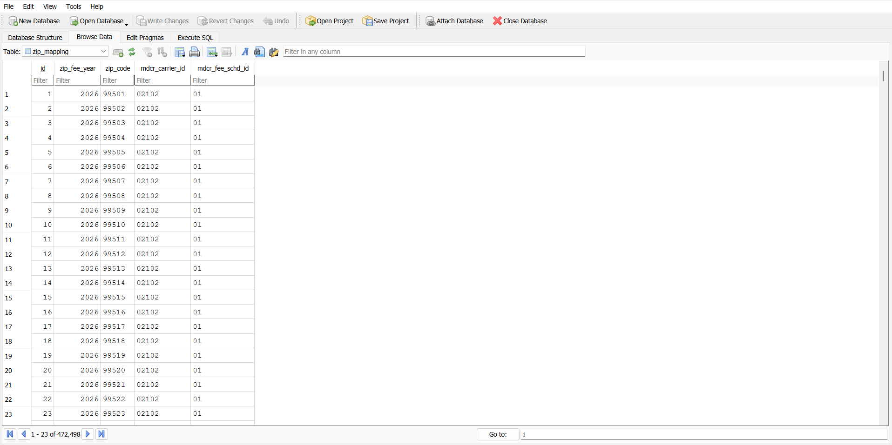
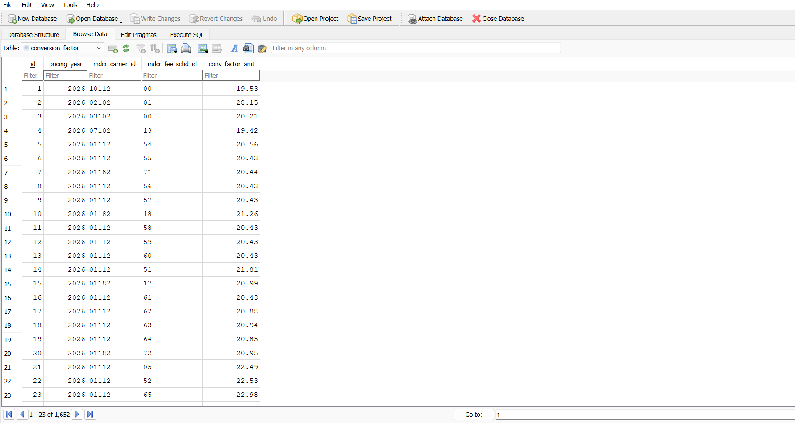
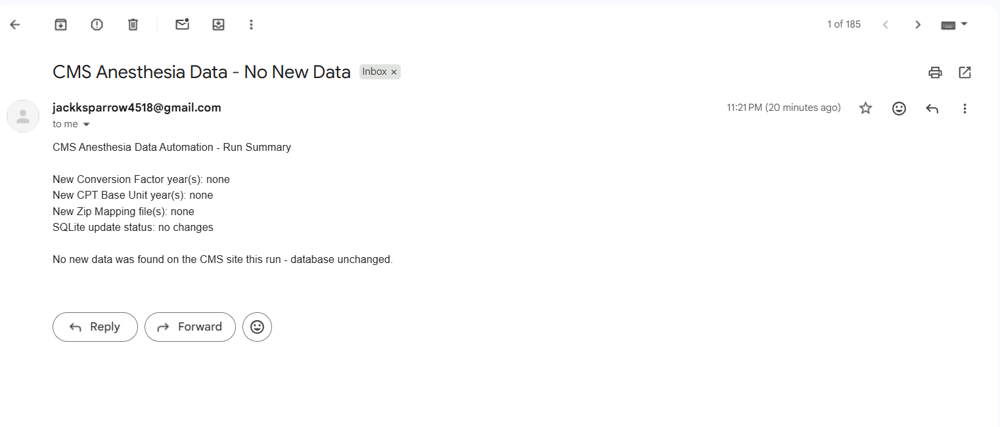

# CMS Anesthesia Data Automation Pipeline

An automated ETL pipeline that pulls Medicare anesthesia pricing data from
two CMS websites, cleans and validates it, and loads it into a local
SQLite database — with an email notification sent after every run. Built
so the data stays current without anyone manually checking the CMS site
or downloading files by hand.

---

## What it does

1. Scrapes **two separate CMS pages** for `.zip` file links.
2. Downloads and extracts any file not already recorded in the database.
3. Cleans each file (skips titles, notes, and blank rows to find the real header).
4. Parses the real header's columns into standardized database column names.
5. Validates that every required column is present before inserting — if not, that row/file is skipped and logged, never partially inserted.
6. Inserts into SQLite, with duplicate-safe constraints so re-running the pipeline never creates duplicate rows.
7. Sends a summary email after every run, whether or not new data was found.

---

## Setup

```bash
# 1. Install dependencies
pip install -r requirements.txt

# 2. Configure email (edit the .env file with your real SMTP details)
cp .env.example .env
# then open .env and fill in SMTP_HOST, SMTP_USERNAME, SMTP_PASSWORD, EMAIL_FROM, EMAIL_TO

# 3. Create the database schema
python main.py init-db
```

If you're on Gmail, `SMTP_PASSWORD` must be an **App Password**, not your normal Gmail password.

---

## Commands

| Command | What it does |
|---|---|
| `python main.py init-db` | Creates/verifies the SQLite schema. Run once before anything else. |
| `python main.py list` | Dry run — shows every file the scraper finds on both CMS pages, without downloading anything. |
| `python main.py check` | Compares discovered files against what's already in SQLite; flags each as `NEW` or `already in SQLite`. |
| `python main.py sync` | Full run: download → extract → clean → parse → validate → insert → email. This is the one to automate. |
| `python main.py schedule` | Runs `sync` continuously in a loop (local testing only — see note below). |

**Recommended first run order:** `init-db` → `list` → `check` → `sync`.

---

## Project structure

| Folder / file | Purpose |
|---|---|
| `main.py` | CLI entry point — `init-db`, `list`, `check`, `sync`, `schedule` |
| `config/settings.py` | URLs for both CMS sources, file paths, dataset keywords, SMTP settings |
| `scraper/scraper.py` | Fetches both CMS pages, finds `.zip` links, tags them by dataset + year |
| `scraper/downloader.py` | Downloads a zip, extracts it, lists usable CSV/Excel/TXT files |
| `parser/cleaner.py` | Finds the real header row (skips titles/notes/blank rows), loads CSV/Excel/TXT |
| `parser/parser.py` | Maps cleaned columns to standardized database columns for all 3 tables; validates required columns |
| `database/db_manager.py` | SQLite schema, duplicate-safe inserts, download history, change log |
| `notifier/notifier.py` | Builds and sends the run-summary email |
| `pipeline/pipeline.py` | Orchestrates the full flow across both sources |
| `pipeline/scheduler.py` | In-process scheduler fallback (cron preferred in production) |
| `.env` / `.env.example` | SMTP/email configuration (`.env` is git-ignored) |
| `requirements.txt` | Python dependencies |
| `downloads/` | Raw zip files + extracted contents (created at runtime) |
| `logs/` | `pipeline.log` (created at runtime) |

---

## How it works

The diagram above walks through the ETL flow: both CMS sources get scraped independently, each discovered file is checked against SQLite, new files are downloaded, cleaned, parsed, validated, and only then inserted into their respective table — followed by one summary email per run.

---

## Database tables

### `zip_mapping` — from Source 1 (ZIP Code to Carrier Locality File)

| Database column | Source column | Description |
|---|---|---|
| `zip_fee_year` | `YEAR/QTR` (year portion only) | The year the pricing applies to. `20254` → `2025`. |
| `zip_code` | `ZIP CODE` | 5-digit ZIP code. |
| `mdcr_carrier_id` | `CARRIER` | Medicare administrative contractor / carrier ID. |
| `mdcr_fee_schd_id` | `LOCALITY` | Locality / fee schedule area ID tied to that ZIP. |

Ignored columns: `STATE`, `RURAL IND`, `LAB CB LOCALITY`, `RURAL IND2`, `PLUS 4 FLAG`, `PART B DRUG INDICATOR`.



### `conversion_factor` — from Source 2 (Anesthesiologists Information Center)

| Database column | Source column | Description |
|---|---|---|
| `pricing_year` | file year | The year this conversion factor applies to. |
| `mdcr_carrier_id` | `Contractor` | Medicare contractor ID. |
| `mdcr_fee_schd_id` | `Locality` | Locality ID. |
| `conv_factor_amt` | `Non-Qualifying APM National Anes CF` (or the single CF column if only one exists) | Dollar amount multiplied by anesthesia base units to calculate payment. |

Ignored columns: `Work GPCI`, `PE GPCI`, `MP GPCI`, `Locality Name`. If both a "Non-Qualifying" and "Qualifying" APM CF column exist, only the Non-Qualifying one is used.



### `cpt_base_units` — from Source 2 (Anesthesiologists Information Center)

| Database column | Source column | Description |
|---|---|---|
| `year` | file year | The year these base units apply to. |
| `cpt_code` | `CODE` | Anesthesia CPT code (HCPCS Level I). |
| `base_units` | `BASE UNIT(S)` | Base unit value for that CPT code. |
| `description` | `DESCRIPTION` (optional) | Human-readable procedure description, if present. |

---

## Email notification

Sent after every `sync` run — whether or not new data was found — so there's always a confirmation the run happened. Subject line changes depending on outcome (`CMS Anesthesia Data Updated` vs `CMS Anesthesia Data - No New Data`).



---

## Technologies used

| Technology | Role |
|---|---|
| Python 3 | Core language |
| `requests` | HTTP calls to fetch CMS pages and download zip files |
| `BeautifulSoup4` | HTML parsing to find `.zip` links |
| `pandas` | Cleaning and parsing CSV/Excel/TXT data |
| `openpyxl` | Reading modern `.xlsx` Excel files |
| `xlrd` | Reading legacy `.xls` Excel files |
| `python-dotenv` | Loads SMTP/email config from `.env` automatically |
| SQLite (`sqlite3`, built-in) | Local database storage |
| `smtplib` (built-in) | Sends the notification email |
| `zipfile` (built-in) | Zip extraction |
